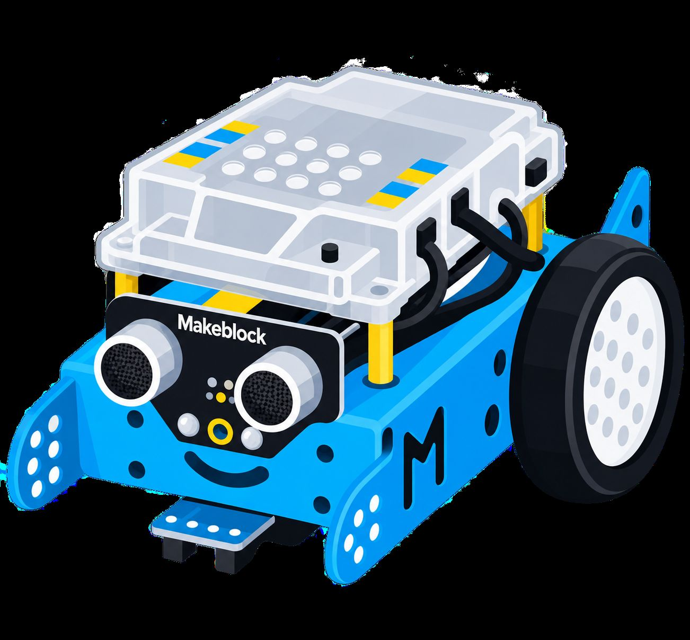

<h1 align="center">Hi 👋, I'm Jorge Beneyto Castelló</h1>
<p align="center">
  <strong>Full Stack Developer</strong> specialising in video pipelines, AI automation & real-time systems
</p><div align="center">



</div>

<p align="center">
  <a href="https://blog-jorbencas.vercel.app/" target="_blank"><strong>🌐 Visit my Personal Blog</strong></a>
</p>

---

### 🧠 About Me

- 🎬 Built an automated video pipeline processing **160+ YouTube channels** and **Twitch streams**, converting and uploading to Telegram with zero manual intervention.
- 📰 Engineered a **AI-powered news system** scraping **500+ sources** (YouTube, RSS, GitHub, Product Hunt), generating summaries with Gemini API and distributing via Telegram + email.
- 🤖 Created a **Telegram bot** with yt-dlp integration, HLS fallback, and real-time AI content generation (tips, tools, news).
- 🎓 I share everything I learn on my [blog](https://blog-jorbencas.vercel.app/) — detailed guides written step by step.

---

### 🚦 CI/CD STATUS — [Tech Pulse](https://github.com/jorbencas/test_githubActions)


---

### 🎯 Featured Projects

<table>
  <tr>
    <td width="33%" valign="top">
      <h3>📡 Tech Pulse</h3>
      <p><em>500+ sources → AI → Telegram + Email + Dashboard</em></p>
      <p>Full automation ecosystem: scrapes, summarizes with Gemini, and distributes via 3 channels. 16 GitHub Actions workflows running 24/7.</p>
      <p>
        
        
        
      </p>
      <p><a href="https://github.com/jorbencas/test_githubActions">Repo</a> · <a href="https://jorbencasdownloaderdocument.surge.sh">Live</a></p>
    </td>
    <td width="33%" valign="top">
      <h3>🎥 DevJobs Pipeline</h3>
      <p><em>Twitch/YouTube → FFmpeg → Telegram</em></p>
      <p>Automated video recording and compression. 6 Docker containers, cron scheduling, zero manual intervention.</p>
      <p>
        
        
        
      </p>
      <p><a href="https://github.com/jorbencas/devjobs">Repo</a> · <a href="https://blog-jorbencas.vercel.app/posts/instalacion-devjobs">Live</a></p>
    </td>
    <td width="33%" valign="top">
      <h3>📰 Tech Blog</h3>
      <p><em>50+ step-by-step guides</em></p>
      <p>Technical writing on Docker, FFmpeg, Python, AI. Built with Astro, deployed on Vercel. Everything documented from scratch.</p>
      <p>
        
        
        
      </p>
      <p><a href="https://blog-jorbencas.vercel.app/">Repo</a> · <a href="https://blog-jorbencas.vercel.app/">Live</a></p>
    </td>
  </tr>
</table>

---

### 🛡️ Engineering Principles

```yml
principles:
  - Clean & Readable: "I write code for humans first, computers second. Deep believer in KISS and SOLID."
  - Automation First: "If a manual task has to be done more than thrice, it deserves a script or a GitHub Action."
  - Architecture Mindset: "Focus on decoupled systems, scalability, and predictable state management."
  - Testing Culture: "A feature isn't 'done' until it's covered by meaningful unit or integration tests."
```

---

### 💻 Tech Stack & Tools

| Frontend | Backend & Databases | DevOps & Tools |
| :--- | :--- | :--- |
| [ TypeScript](https://github.com/jorbencas?tab=repositories&q=typescript) | [ Node.js (Express)](https://github.com/jorbencas?tab=repositories&q=nodejs) | [ Docker](https://github.com/jorbencas?tab=repositories&q=docker) |
| [ React / React Native](https://github.com/jorbencas?tab=repositories&q=react) | [ Python](https://github.com/jorbencas?tab=repositories&q=python) | [ Linux](https://github.com/jorbencas?tab=repositories&q=linux) |
| [ Vue.js](https://github.com/jorbencas?tab=repositories&q=vuejs) | [ PostgreSQL](https://github.com/jorbencas?tab=repositories&q=postgresql) | [ Git & Actions](https://github.com/jorbencas?tab=repositories&q=github-actions) |
| [ Tailwind CSS](https://github.com/jorbencas?tab=repositories&q=tailwindcss) | [ Prisma](https://github.com/jorbencas?tab=repositories&q=prisma) | [ Jest](https://github.com/jorbencas?tab=repositories&q=jest) |
| | [ Socket.IO](https://github.com/jorbencas?tab=repositories&q=socketio) | |

---

### 📝 Latest Blog Posts
<!-- BLOG-POST-LIST:START -->
- [Instalación del Ecosistema Devjobs: Pipeline Completo desde Cero](https://blog-jorbencas.vercel.app/posts/instalacion-devjobs)
- [Refactor SOLID: del JavaScript monolítico a una arquitectura reactiva](https://blog-jorbencas.vercel.app/posts/centralizar-ssim-duplicado-en-modulo-compartido)
- [Gestionar entornos virtuales de Python en Ubuntu con aliases](https://blog-jorbencas.vercel.app/posts/gestionar-venv-python-ubuntu)
- [Inteligencia Artificial a nivel técnico: de los tokens al RAG, pasando por los LLM](https://blog-jorbencas.vercel.app/posts/fundamentos_de_ia_tecnica)
- [Instalación de FFmpeg + yt-dlp: Conversor de Vídeo y Pipeline de Compresión](https://blog-jorbencas.vercel.app/posts/instalacion-ffmpeg)
<!-- BLOG-POST-LIST:END -->

---

### 🤝 Contact

<p align="center">
  <a href="https://blog-jorbencas.vercel.app/"></a>
  <a href="https://github.com/jorbencas"></a>
</p>

<p align="center">
  <em>Let's build something together.</em>
</p>

---

### 💬 Anonymous Feedback

*Have we worked together, or has my content been helpful to you? Leave a review:*
👉 [**Leave Feedback**](https://github.com/jorbencas/jorbencas/issues/new?template=feedback.yml)

<!-- START_FEEDBACK_WALL -->
> "Prueba de Feedback con el githubactions" — **Anónimo** (jun 2026)
<br/>


<!-- END_FEEDBACK_WALL -->
